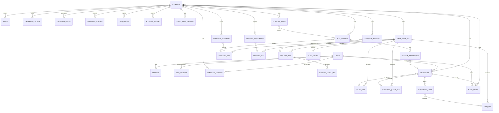

# Frosthaven Campaign Tracker: Architecture & Data Model (Phase 2)

Status: **approved 2026-10-05** with the default answers in §10. Phase 3 (skeleton) implements accounts, sessions, campaigns, roles and invites.

> **Copyright note.** This repository contains **no** game content from Cephalofair Games: no rule text, scenario/section names, numbers taken from the books, or images.
> The rule PDFs and everything derived from them (rules reference, scenario/section data) live outside the repository (the local `docs/` folder is gitignored, and seed data is mounted at runtime).
> Code that implements a rule cites a rule ID such as `R-SCN-03` from the local, uncommitted `docs/RULES_REFERENCE.md`.

---

## 1. Stack (versions checked on 2026-10-05 against npm / Docker Hub / nodejs.org)

| Concern                | Choice                                                                                               | Pinned version                                         | Why                                                                                                                                 |
| ---------------------- | ---------------------------------------------------------------------------------------------------- | ------------------------------------------------------ | ----------------------------------------------------------------------------------------------------------------------------------- |
| Runtime                | Node.js **24 LTS** ("Krypton")                                                                       | `node:24.21.0-alpine`                                  | Current LTS line. Node 26 is not LTS yet                                                                                            |
| Package manager / repo | pnpm workspaces (monorepo)                                                                           | pnpm 12.9.1 (via corepack)                             | One repo for server, web and shared code. Strict dependency isolation                                                               |
| Language               | TypeScript, strict                                                                                   | **6.0.3**                                              | TS 7.0 is out, but `typescript-eslint` 8.71 supports TS `<6.1` only, so we pin 6.0.x                                                |
| HTTP server            | Fastify                                                                                              | 5.12.5                                                 | Mainstream, fast, first-class TS, good plugin ecosystem (cookie, rate-limit, static, helmet)                                        |
| API                    | tRPC (Fastify adapter) + zod                                                                         | @trpc/server 11.19.0, zod 4.6.5                        | End-to-end types without codegen. zod validates every input. A few plain REST routes for health, assets, OIDC callback, seed export |
| DB                     | PostgreSQL                                                                                           | `postgres:18.6-alpine`                                 | Required by brief. Note: PG 18 image mounts data at `/var/lib/postgresql` (changed from `/data`)                                    |
| ORM / migrations       | Drizzle ORM + drizzle-kit                                                                            | 0.45.3 / 0.31.11 (+ `pg` 8.23.1)                       | Typed SQL, plain SQL migration files in git, simple programmatic migrator for startup. (Drizzle 1.0 is still RC → not used)         |
| Password hashing       | Argon2id via `@node-rs/argon2`                                                                       | 2.2.1                                                  | Prebuilt native binaries (incl. musl/alpine), no node-gyp                                                                           |
| OIDC (feature flag)    | `openid-client`                                                                                      | 6.8.8                                                  | Certified client. Auth code + PKCE. Works with Authelia/Authentik                                                                   |
| Frontend               | React SPA + Vite                                                                                     | react 19.3.0, vite 8.3.2, @vitejs/plugin-react 6.1.2   | SPA is enough (no SEO). Served by Fastify from the same container                                                                   |
| Routing / data         | TanStack Router + TanStack Query (tRPC integration)                                                  | 1.170.41 / 5.104.1, @trpc/tanstack-react-query 11.19.0 | Type-safe routes, caching, optimistic +/- updates                                                                                   |
| Styling                | Tailwind CSS v4 + small own component set (Radix primitives where needed)                            | 4.3.3                                                  | Fast mobile-first UI, dark mode via `prefers-color-scheme` + toggle                                                                 |
| PWA                    | vite-plugin-pwa (Workbox)                                                                            | 2.0.0                                                  | Installable, offline app shell. Data stays online-only (no offline writes in v1)                                                    |
| Map                    | Leaflet with `CRS.Simple` + react-leaflet                                                            | 1.9.4 / 5.0.0                                          | Zoom/pan/touch on a plain image, markers in image coordinates                                                                       |
| i18n                   | i18next + react-i18next                                                                              | 26.4.2 / 17.0.15                                       | English now. Keys structured so `de` can be added. The DE game glossary is ready locally                                            |
| Logging                | pino (Fastify default)                                                                               | 10.4.0                                                 | JSON logs to stdout                                                                                                                 |
| Tests                  | Vitest (unit + API), Testcontainers PostgreSQL (integration), Playwright (E2E incl. mobile viewport) | 5.0.3 / 12.2.0 / 1.63.0                                | Real Postgres in integration tests. Docker is available on the dev box and in CI                                                    |
| Lint / format          | ESLint 10 + typescript-eslint 8.71, Prettier 3.9                                                     | as listed                                              |                                                                                                                                     |
| Reverse proxy          | Traefik (existing)                                                                                   | latest stable v3.7.x                                   | Labels per Traefik v3 docs (verified again in Phase 3)                                                                              |

**Alternatives considered:** Next.js (SSR not needed, heavier container); Prisma (bigger runtime and engine binary, less control over SQL); REST + OpenAPI (more boilerplate for a TS-only client). We can switch to REST later if a non-TS client is ever needed, because tRPC procedures map 1:1 to commands.

### Repository layout

```
apps/
  server/        Fastify + tRPC, auth, migrations, seed import, serves the web build
  web/           React SPA (PWA)
packages/
  shared/        zod schemas (API + seed format), i18n keys, shared types
  rules/         pure rule logic (no I/O): availability, level-up, prosperity, sessions, …
seed-example/    placeholder seed data (fictional names/values) for dev, tests, CI
design/          this document
docker/          Dockerfile, compose files, backup script
```

`packages/rules` is pure functions over plain data. That makes the rule logic unit-testable and keeps it apart from the DB.

---

## 2. Game data vs. code (copyright-driven split)

| Lives in code (repo)                                                                                                                                                            | Lives in seed data (outside repo, mounted)                                                                                                                                                                                                             |
| ------------------------------------------------------------------------------------------------------------------------------------------------------------------------------- | ------------------------------------------------------------------------------------------------------------------------------------------------------------------------------------------------------------------------------------------------------ |
| Algorithms: availability computation, level-up rules, checkmark→perk math, prosperity level from checks, outpost step order, session application, etc. Each one cites a rule ID | All values that come from the books: XP thresholds, prosperity thresholds, scenario-level table, morale→defense table, preprinted calendar sections, scenarios, sections + effects, classes, buildings, items, personal quests, campaign sticker names |
| Data model and generic effect types (`unlockScenario`, `lockOutScenario`, `gainCampaignSticker`, `adjust{prosperity,morale,…}`, `addCalendarSection`, …)                        | The concrete effects attached to each section                                                                                                                                                                                                          |
| Placeholder `seed-example/` with invented values (e.g. "Example Scenario A")                                                                                                    | Real seed directory, imported by an admin                                                                                                                                                                                                              |

Unit tests run against **fixture tables** in the test files (deliberately not the real values), so CI never needs the copyrighted data.
**→ Question P2-1 below**: are the purely numeric tables OK to commit as code? (Default: no, keep them in seed.)

---

## 3. Domain model (ER diagram)



### Key tables (abridged; all have `id uuid`, `created_at`, `updated_at`, and a `version int` for optimistic locking where edited)

**Accounts**

- `user`: `username` (unique, citext), `email` (unique, nullable), `password_hash` (nullable when OIDC-only), `display_name`, `is_site_admin`, `locale`, `theme`, `disabled_at`.
- `session`: `token_hash` (SHA-256 of a random 32-byte token, PK), `user_id`, `expires_at`, `last_seen_at`, `user_agent`, `ip`.
- `oidc_identity`: `issuer`, `subject` (unique pair), `user_id`.
- `campaign_member`: (`campaign_id`, `user_id`) PK, `role` ∈ {`host`, `player`}. Roles are **per campaign**. A campaign may have several hosts.
- `invite`: `campaign_id`, `code_hash`, `role`, `expires_at`, `max_uses`, `uses`, `revoked_at`.

**Reference data** (one `game_data_set` per imported seed. Campaigns pin one set, so a re-import doesn't silently change a running campaign. Migrating a campaign to a new set is an explicit action)

- `rule_tables`: one JSON document validated by zod (XP thresholds, prosperity thresholds, scenario-level table, morale→defense table, preprinted calendar, starting gold formula params, …) – R-CHAR-03, R-CAMP-04/05/08, R-SCN-13.
- `scenario_def`: `number`, `name`, `map_coord`, `region`, `complexity?`, `requirements jsonb` (`[{campaignSticker, minCount?}] | [{freeText}]`), `conclusion_sections text[]`, `initially_unlocked`, **`marker_x`, `marker_y`** (0–1 relative to the map image, set in marker mode), `marker_layer` (`world` | `town`).
- `section_def`: `ref` (e.g. "12.3"), `title`, `scenario_number?`, `effects jsonb` (typed effect list, §5), `text_excerpt?` (optional, from the private seed only).
- `class_def`: `key`, `name`, `starting`, `perks jsonb` (`[{text, boxes, linked}]`), `masteries jsonb`, `max_hp_by_level int[]?`, `hand_size?`.
- `building_def` / `building_level_def`: number, name, level, costs (`prosperity`, materials), repair/rebuild cost, effect texts, `max_soldiers?`, `soldier_attack_reduction?`.
- `item_def`: number, name, type, gold cost?, craft cost?, quantity. `personal_quest_def`: number, name, envelope, alt envelope.

**Campaign state**

- `campaign`: `name`, `party_name`, `game_data_set_id`, `current_week` (0..), `prosperity_checks`, `morale`, `defense`, `soldiers`, `inspiration`, supply columns (`lumber`, `metal`, `hide`, `arrowvine`, `axenut`, `corpsecap`, `flamefruit`, `rockroot`, `snowthistle`), `morale_min_section`, `morale_max_section`, `variants jsonb` (casual/solo/permadeath/respec flags), `notes`.
  Derived (not stored): season, year, prosperity level, morale defense modifier, effective defense.
- `campaign_scenario`: `scenario_number`, `status` ∈ {`unlocked`, `completed`, `locked_out`} (no row = locked), `times_completed`, `rewards_claimed`, `unlocked_by` (section ref / manual / treasure), `requirement_overrides jsonb` (host "treat as met").
- `campaign_building`: `building_number`, `state` ∈ {`unlocked`, `built`, `wrecked`}, `level`.
- `campaign_sticker`: `name`, `count` (some stickers can be gained repeatedly), `history`.
- `calendar_entry`: `week`, `section_ref`, `source` ∈ {`preprinted`, `added`}, `resolved_at`.
- `treasure_looted`, `item_supply` (available counts), `alchemy_reveal`, `event_deck_change` (deck, event id, add/remove).

**Characters**

- `character`: `campaign_id`, `owner_user_id`, `class_key`, `name`, `status` ∈ {`active`, `set_aside`, `abandoned`, `retired`, `dead`}, `level`, `xp`, `gold`, 9 resource columns, `checkmarks` (0–18), `perk_marks jsonb` (marks per perk box), `masteries_achieved bool[]`, `bonus_perk_marks` (from previous retirements), `personal_quest_number?`, `personal_quest_progress text`, `notes`, `retired_at`.
  Partial unique index: one character per (`campaign_id`, `class_key`) where status ∈ {active, set_aside} – R-CHAR-02.
- `character_item`: `item_number?` or `free_text`, unique (`character_id`, `item_number`) – R-CHAR-15.

**Play & history**

- `play_session`: `date`, `scenario_number?`, `scenario_level`, `outcome` ∈ {`completed`, `lost`}, `lost_choice` ∈ {`return`, `replay`}, `casual`, `road_event_note`, `notes`, `status` ∈ {`draft`, `applied`, `reverted`}.
- `session_participant`: `character_id`, `coins`, `xp_from_dial`, `checkmarks`, `new_masteries int[]`, `looted_resources jsonb`, `applied_delta jsonb` (exactly what was added, so a session can be reverted).
- `outpost_phase`: `week`, `current_step` (1–5), per-step notes/flags (event drawn, attack result, …).
- `section_application`: `section_ref`, `applied_by`, `effects_applied jsonb` (after host edits), `session_id?`.
- `audit_entry`: `campaign_id`, `character_id?`, `actor_user_id`, `at`, `entity`, `entity_id`, `action`, `before jsonb`, `after jsonb`, `group_id` (one user action that touches several rows), `reverted_by?`.

### Audit & revert design

All writes go through **command handlers** (one per tRPC mutation). Each handler runs in a transaction, loads the affected rows, applies the change, and writes `audit_entry` rows with before/after snapshots of the changed fields, grouped by `group_id`.
**Revert** = apply the `before` values of a group, but only if the current values still equal its `after` values (otherwise a conflict is shown and the user resolves it manually). A revert is itself audited.
Players can revert their own character's entries. Hosts can revert anything in their campaign.

---

## 4. Rule logic (packages/rules), all pure and unit-tested

- `scenarioAvailability(state, dataSet)` → per scenario `locked | available | blocked(unmet requirements) | completed | lockedOut` + link hints. Availability is **only** computed from data (unlock rows, requirement data, stickers) – R-SCN-02/03/04.
- `applySection(state, effects)` → new state + diff (unlock, lock out, stickers, counters, calendar adds, …) – R-SCN-05/05a/19.
- `applySessionResult(...)` → gold, XP + bonus XP, checkmarks→perk marks, inspiration, rewards-once rule, lost/replay handling (values from `rule_tables`) – R-SCN-07…14.
- `prosperityLevel(checks, thresholds)`, `canLevelUp…`, `startingGold`, `checkmarkLossClamp`, `perkMarksAvailable`, `moraleDefenseModifier`, `seasonOf(week)`, `outpostStepOrder` …
- Each function's doc comment lists the rule IDs. Each test names the rule ID in its title (e.g. `it('R-CHAR-11: checkmarks can only be lost back to last full set', …)`).

---

## 5. Seed-data format

A seed is a **directory** (or a `.zip` of it). Every file is validated by zod schemas from `packages/shared`. JSON Schema files are generated from them (`z.toJSONSchema`), so an editor can validate while typing.

```
manifest.json          { "format": 1, "name": "...", "version": "2026-10-05", "locale": "en" }
rule-tables.json       XP thresholds, prosperity thresholds, scenario-level table, morale→defense, preprinted calendar, ...
scenarios.json         [{ number, name, coord, region?, complexity?, requirements[], conclusionSections[], initiallyUnlocked, marker? }]
sections.json          [{ ref, title, scenario?, effects: Effect[] }]
classes.json           [{ key, name, starting, perks[], masteries[], maxHpByLevel?, handSize? }]
buildings.json         [{ number, name, levels: [{ level, buildCost?, upgradeCost?, repairCost?, rebuildCost?, maxSoldiers?, ... }] }]
items.json             [{ number, name, type, goldCost?, craftCost?, quantity }]
personal-quests.json   [{ number, name, envelope?, altEnvelope? }]
```

`Effect` is a discriminated union (`type` field):
`unlockScenario {scenario, link?: "linked"|"forced", condition?}` · `lockOutScenario {scenario}` · `chooseOne {options: Effect[]}` · `gainCampaignSticker {name}` · `loseCampaignSticker {name}` · `adjust {target: "morale"|"prosperity"|"inspiration"|"soldiers"|"defense", amount}` · `setMorale {formula?}` · `addCalendarSection {section, weeksAhead}` · `eventDeck {deck, events[], op}` · `unlockClass {}` (host picks) · `openEnvelope {id}` · `readSection {ref}` · `manual {note}` (anything not machine-applicable).

Where seed data lives:

- **Repo:** `seed-example/` (fictional data, for dev, tests and the E2E test).
- **Server:** mounted volume `/data/seed` (Unraid: `/mnt/user/appdata/frosthaven-tracker/seed`). On first start with an empty DB the app imports it automatically if present. Later imports and exports happen from the admin UI. The draft seed I generated in Phase 1 (local `docs/data/`) will be converted to this format; it never enters git.
- Map/marker positions edited in the UI are exported back into `scenarios.json` (so they survive a re-import).

---

## 6. API outline (tRPC routers; all inputs zod-validated, all procedures authenticated unless noted)

| Router              | Procedures (q = query, m = mutation)                                                                                                                                                                                                           | Authorization                                      |
| ------------------- | ---------------------------------------------------------------------------------------------------------------------------------------------------------------------------------------------------------------------------------------------- | -------------------------------------------------- |
| `auth`              | `register` m (public, can be disabled by env), `login` m (public, rate-limited), `logout` m, `me` q, `changePassword` m, `sessions` q / `revokeSession` m                                                                                      | —                                                  |
| REST `/auth/oidc/*` | `start`, `callback` (feature flag `OIDC_ENABLED`)                                                                                                                                                                                              | public                                             |
| `campaign`          | `list` q, `create` m, `get` q, `update` m, `members` q, `setRole` m, `removeMember` m, `createInvite` m, `revokeInvite` m, `acceptInvite` m                                                                                                    | member / host                                      |
| `campaignState`     | `get` q (incl. derived values), `adjust` m (`{field, delta}` for +/- counters, server clamps), `setValue` m, `stickers.add/remove` m, `calendar.advance` m, `calendar.addSection` m, `calendar.resolve` m, `treasure.mark` m                   | read: member, write: host                          |
| `scenario`          | `list` q (with computed availability), `get` q, `unlock` m, `lockOut` m, `setStatus` m (manual fix), `overrideRequirement` m                                                                                                                   | read: member, write: host                          |
| `section`           | `get` q (`"X.Y"` → effects preview), `apply` m (host may edit effects first), `history` q                                                                                                                                                      | host                                               |
| `session`           | `list` q, `get` q, `createDraft` m, `update` m, `apply` m, `revert` m                                                                                                                                                                          | read: member, write: host                          |
| `outpost`           | `current` q, `start` m, `completeStep` m, `building.build/upgrade/rebuild/damage/wreck/repair` m                                                                                                                                               | host                                               |
| `character`         | `list` q, `get` q, `create` m, `update` m, `adjust` m (+/- xp, gold, resources, checkmarks), `levelUp` m, `markPerk` m, `setMastery` m, `items.add/remove/sell` m, `transferResourcesToSupply` m, `setAside`/`abandon`/`retire` m, `history` q | read: member, edit: owner (+ host)                 |
| `audit`             | `list` q (campaign or character scope), `revert` m                                                                                                                                                                                             | owner for own character, host for campaign         |
| `catalog`           | `get` q, `upsert*` m, `markers.set` m                                                                                                                                                                                                          | read: member; write: site admin or host (see P2-3) |
| `admin`             | `users` q, `setAdmin`/`disable` m, `seed.import` m, `seed.export` (REST download)                                                                                                                                                              | site admin                                         |
| REST                | `GET /healthz` (public), `GET /assets/*` (members only, from `/data/assets`), `GET /api/assets/manifest`                                                                                                                                       |                                                    |

Every procedure resolves `ctx.user` and the campaign membership/role in middleware. Authorization helpers (`requireMember`, `requireHost`, `requireCharacterOwnerOrHost`) are used on **every** campaign/character procedure, and integration tests cover the denial cases.

---

## 7. Auth & security design

- **Passwords**: Argon2id (`@node-rs/argon2`, library defaults, parameters stored in the PHC string so they can be raised later). Minimum length 10, checked against a small built-in common-password list.
- **Sessions**: random 256-bit token in an `HttpOnly; Secure; SameSite=Lax; Path=/` cookie (`__Host-` prefix in production). Only the SHA-256 hash is stored in the DB. Sliding expiry (default 30 days, renewed when less than 15 days are left). Logout and password change invalidate sessions.
- **CSRF**: `SameSite=Lax` cookie **plus** a server check on every non-GET request that `Origin` (or `Referer`) matches `PUBLIC_URL`. tRPC mutations must also carry `content-type: application/json`, which a cross-site HTML form cannot send without a CORS preflight. No CORS is enabled.
- **Rate limiting**: `@fastify/rate-limit` on `login`/`register`/`acceptInvite` (per IP and per username, e.g. 10/15 min). Failed logins get a constant-time response. In-memory store (single instance).
- **Proxy trust**: Fastify `trustProxy` is set from `TRUSTED_PROXIES` (CIDR of the Traefik network, e.g. `172.18.0.0/16`). Only then are `X-Forwarded-For/Proto/Host` honoured. `PUBLIC_URL` is the canonical origin used for cookies, CSRF checks and OIDC redirects.
- **Headers**: `@fastify/helmet` with a strict CSP (self only, plus `img-src 'self' blob: data:` for the map).
- **Invites**: random code (shown once, stored hashed) with role, expiry and max uses. Link form `/join/<code>`.
- **First admin**: `ADMIN_USERNAME` / `ADMIN_PASSWORD` (or `ADMIN_PASSWORD_FILE`) env vars create a site admin on first start if no admin exists. They are ignored afterwards (and the logs say so).
- **OIDC (optional, `OIDC_ENABLED=true`)**: auth code + PKCE via `openid-client`. Users are matched by `(issuer, sub)`. On first login, an account is auto-created or linked to an existing one by verified email (configurable). Implemented in Phase 7 only if it stays cheap; the data model already supports it.
- **Secrets**: all from env (`DATABASE_URL`, `SESSION_SECRET` for signing auxiliary cookies, admin bootstrap, OIDC creds). `.env.example` is in the repo, `.env` is gitignored.

---

## 8. Screens (mobile-first; bottom tab bar on phones, sidebar on desktop)

**Public:** Login · Register (if enabled) · Join campaign (`/join/:code`)

**User:** Campaign list (my campaigns, role badge, create campaign) · Profile (password, sessions, language, theme)

**Campaign (players read-only, hosts edit):**

1. **Dashboard**: week/season/year, prosperity (level + checks to next), morale + defense modifier, total defense, soldiers, inspiration, Frosthaven supply, campaign stickers, pending calendar sections, quick "+/-" tiles (host).
2. **Scenarios**: tabs _Available · Completed · Blocked · Locked out_. Search by number/name. Detail shows requirements and their status, conclusion sections, what unlocked it, and link hints.
3. **Map**: Leaflet map from `/data/assets` (world + town layers), markers coloured by status, tap → scenario detail. Without assets it shows a placeholder grid map using the scenario coordinates. **Host "place markers" mode**: pick a scenario, tap the map, save.
4. **Sessions**: list, plus a **"Log a session" wizard**: scenario + level (recommended level suggested), participants, per-character results (coins, XP dial, checkmarks, masteries, looted resources), outcome (completed / lost → return or replay), then preview of all resulting changes → apply. After applying: "read conclusion section" shortcut and linked-scenario suggestion.
5. **Read section**: enter "X.Y" → pre-filled effects (editable) → apply. Used for conclusions, events, calendar entries.
6. **Outpost phase wizard**: 1 passage of time (shows sections due this week) → 2 event (log + effects, attack helper) → 3 building operations (checklist) → 4 downtime (per-character actions: level up, retire, create, craft, brew, sell, buy) → 5 construction (build/upgrade/rebuild with prosperity/cost validation where data exists).
7. **Buildings**: list with state/level, damage/wreck/repair/rebuild actions.
8. **Party**: characters of the campaign (active, set aside, retired history) and the retirement table.
9. **Members & invites** (host) · **Campaign settings** (variants, data set) · **Audit log** (filter, revert).

**Character:** Character sheet (big +/- counters for XP, gold, 9 resources, checkmarks; level with "level-up available" banner; perks with box marking; masteries; items; personal quest; notes) · Create character (class picker filtered by availability, starting gold/level/perk-mark hints) · Retire / set aside / abandon flows · Character history (audit, revert).

**Admin:** Users · Seed import/export · Catalog editor (scenarios, sections + effects, classes, buildings, items, PQs, rule tables).

Large touch targets (≥ 48 px), +/- buttons with long-press repeat, optimistic updates with rollback on error, dark mode default following the OS.

---

## 9. Deployment sketch (built in Phase 3, documented in Phase 7)

- Multi-stage Dockerfile: `node:24.21.0-alpine` build stage (pnpm install, build web + server, `pnpm deploy --prod`) → small runtime stage, non-root `node` user, `HEALTHCHECK` hitting `/healthz`.
- On start: wait for DB → run Drizzle migrations under a Postgres **advisory lock** (safe with restarts) → bootstrap admin → optional first seed import → listen.
- `docker-compose.yml`: `app` + `db` (`postgres:18.6-alpine`, volume at `/var/lib/postgresql`) + `backup` sidecar (`pg_dump` on a schedule into `/backups`, with retention). Networks: internal `frosthaven` + external `traefik`. No published ports. Traefik labels with host, entrypoint and cert resolver from env.
- Volumes from env with Unraid defaults: `/mnt/user/appdata/frosthaven-tracker/{db,assets,seed,backups}`.

---

## 10. Decisions (Phase 2 checkpoint)

All questions were answered with the defaults below (user, 2026-10-05).

| ID   | Question                                                                                                                                                                                                   | Default                                                                            |
| ---- | ---------------------------------------------------------------------------------------------------------------------------------------------------------------------------------------------------------- | ---------------------------------------------------------------------------------- |
| P2-1 | Numeric rule tables (XP thresholds, scenario-level table, prosperity thresholds, morale→defense): may they be committed as code constants, or must they stay in the private seed like all other game data? | Keep them in the private seed (`rule-tables.json`). Code and tests use fixtures    |
| P2-2 | Self-registration: open registration, or invite-only (accounts only created via invite link or by admin)?                                                                                                  | Invite-only + admin. `ALLOW_REGISTRATION=false`                                    |
| P2-3 | Who may edit reference data (catalogs, markers)?                                                                                                                                                           | Site admins **and** campaign hosts (single-group home server). Each change audited |
| P2-4 | Character ability-card pool tracking (from Phase 1 Q-18)                                                                                                                                                   | Not in v1                                                                          |
| P2-5 | Offline use at the table: PWA app shell only (needs network for data), or offline edits with sync later?                                                                                                   | App shell only in v1                                                               |
| P2-6 | Several parallel campaigns on one instance (each with its own data set)?                                                                                                                                   | Yes, supported by the model                                                        |

Additional implementation notes from Phase 3:

- The server and the internal packages run as TypeScript directly on Node 24 (built-in type stripping), so `tsc` only type-checks. Code uses erasable syntax only (no enums or parameter properties).
- The deployment guide goes in `DEPLOYMENT.md` at the repo root, because `docs/` is private and gitignored.
- pnpm 12 blocks dependency build scripts by default. The ones we don't need are explicitly denied in `pnpm-workspace.yaml` (`allowBuilds`).
